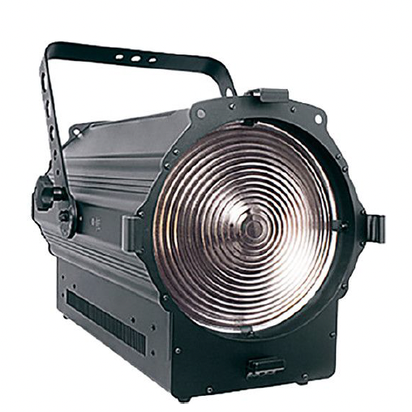
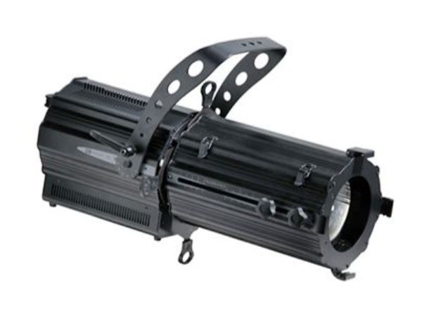
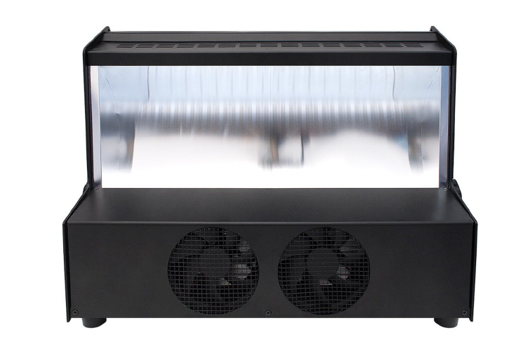
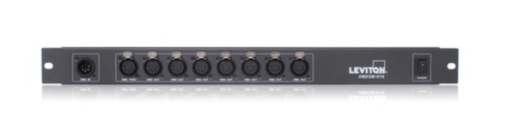

# Navy Yard Lighting Inventory List

## 1. LED Fresnel

| Model | Qty | Watt | Color Temp | Dimensions (cm) | DMX Ch | Sheet |
|-------|-----|------|------------|------------------|--------|-------|
| LFD32-50B | 19 | 320W | 5600K | 35 x 49 x 49 | 5 | [Link](https://www.leviton.com/en/products/lfd32-50b) |

### Barn Door

| Model | Qty |
|-------|-----|
| LFD32-BDB | 19 |

---

## 2. LED Ellipsoidal (Profile)

| Model | Qty | Watt | Color Temp | Dimensions (cm) | Weight (kg) | DMX Ch | Sheet |
|-------|-----|------|------------|------------------|-------------|--------|-------|
| LED00-50B | 2 | 200W | 5600K | 25 x 47 x 35 | 8.3 | 5 | [Link](https://www.leviton.com/en/products/led00-50b) |

### Lens Tube

| Model | Qty | Field Angle | Weight (kg) | Sheet |
|-------|-----|-------------|-------------|-------|
| LED18-LTB | 2 | 18-36° | 15.6 | [Link](https://www.leviton.com/en/products/led18-ltb) |

---

## 3. LED Cyclorama

| Model | Qty | Watt | Color | Dimensions (cm) | Weight (kg) | DMX Ch | Sheet |
|-------|-----|------|-------|------------------|-------------|--------|-------|
| LWCYC-000 | 16 | 350W | RGBW | 41 x 63 x 21 | 12.6 | 4 | [Link](https://goknight.com/leviton-lwcyc-00b-led-cyclorama-light/) |

> Note: 1 unit is used, 15 are new. This is the only fixture with color changing capability.

---

## 4. Control Equipment

### DMX Splitter

| Model | Qty | Description | Channels | Sheet |
|-------|-----|-------------|----------|-------|
| DMXSM-H18 | 2 | DMX Splitter 1-in 8-out | 512 per output | [Link](https://www.leviton.com/en/products/dmxsm-h18) |

---

## Summary

| Category | Qty |
|----------|-----|
| LED Fresnel (5600K) | 19 |
| Barn Door | 19 |
| LED Ellipsoidal / Profile (5600K) | 2 |
| Lens Tube (18-36°) | 2 |
| LED Cyclorama (RGBW) | 16 |
| DMX Splitter | 2 |
| **Total** | **60** |

---

*Last Updated: 2026-02-09*
