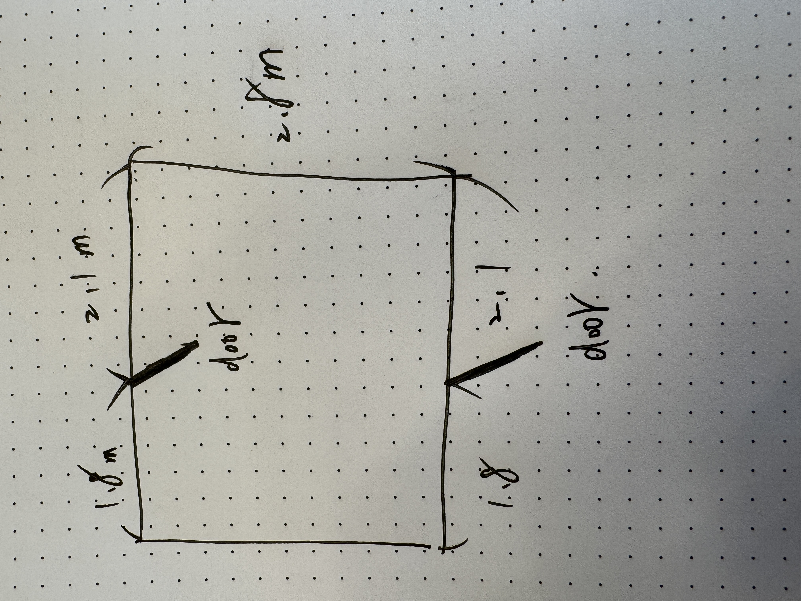

# Navy Yard Lighting Plan

## Equipment Inventory

See full inventory details: [Leviton Inventory Summary](Leviton_Inventory_Summary.md)

---

## Storage Requirements

### Equipment to Store

| Equipment | Qty | Dimensions (cm) | Weight (kg) |
|-----------|-----|-----------------|-------------|
| LED Fresnel (LFD32) | 58 | 35 × 49 × 49 | ~8-10 each |
| LED Cyclorama (LWCYC) | 16 | 41 × 63 × 21 | 12.6 each |
| Barn Doors | 26 | Ø 30.5 | - |
| DMX Cables | 144 | various | - |

**Total Fresnel weight:** ~580 kg
**Total Cyclorama weight:** ~200 kg

---

## Storage Space



| Dimension | Metric | Imperial |
|-----------|--------|----------|
| **Width** | 200 cm (2.0 m) | 78.7" (6.6 ft) |
| **Depth** | 212 cm (2.12 m) | 83.5" (7.0 ft) |
| **Height** | 250 cm (2.5 m) | 98.4" (8.2 ft) |
| **Area** | 4.2 m² | 45.2 ft² |

### 3D Model

| Perspective View | Top View |
|------------------|----------|
|  |  |

---

## Storage Plan

### McMaster-Carr Shelving


#### Recommended Model

| Spec | Imperial | Metric |
|------|----------|--------|
| **Model** | Extra Heavy Duty 48" × 96" × 24" | |
| **Part Number** | 4952T24 | |
| **Width** | 48" | 122 cm |
| **Height** | 96" | 244 cm |
| **Depth** | 24" | 61 cm |
| **Shelves** | 5 layers (adjustable) | |
| **Total Capacity** | 11,000 lbs | 4,990 kg |
| **Per Shelf Capacity** | 4,000 lbs | 1,814 kg |
| **Price** | $609 each | |

---

### Capacity Calculation

#### Fresnel Storage

| Parameter | Value |
|-----------|-------|
| Fresnel size | 35 × 49 × 49 cm (14" × 19" × 19") |
| Shelf width | 122 cm (48") |
| Units per row | 3 (35 cm × 3 = 105 cm) |
| Shelf depth | 61 cm (24") |
| Fresnel depth | 49 cm (19") ✓ fits |
| Required layer height | ~55 cm (22") |
| Usable layers per unit | 4 |
| **Capacity per shelf unit** | **12 units** |
| **Units needed for 58 Fresnel** | **5 shelf units** |

#### Space Constraint

```
Room Layout (Top View)

         ┌─────────────────────────────────┐
         │                                 │
  200 cm │   Walking Space (~80 cm min)    │
         │                                 │
         ├───────────┬──────┬──────────────┤
         │  Shelf A  │ Door │   Shelf B    │
         │ (122 cm)  │      │  (122 cm)    │
         └───────────┴──────┴──────────────┘
                       212 cm
```

**問題：空間只能放 2-3 個架子，但標準排列 Fresnel 需要 5 個**

---

### Revised Plan - Compact Storage

#### 交錯排列 (Staggered Layout)

Fresnel 的 yoke (C夾) 可以互相交錯，提高密度：

```
Layer side view (交錯排列):

  ┌─┐ ┌─┐ ┌─┐
  │ │ │ │ │ │   ← 前排 3 units
┌─┘ └─┘ └─┘ └─┐
│   │   │   │   ← 後排 3 units (offset)
└───┴───┴───┘

每層可放 6 units (交錯後)
```

#### Shelf Assignments

| Shelf | Contents | Qty | Notes |
|-------|----------|-----|-------|
| **Shelf A** | LED Fresnel | 30 | 5 layers × 6 units |
| **Shelf B** | LED Fresnel | 28 | 5 layers × ~6 units |
| **Shelf B (top)** | Barn Doors | 26 | 頂層 |
| **Wall pipe** | Cyclorama | 16 | 牆掛式 |
| **Cable bin** | DMX Cables | 144 | 地面或底層 |

> **Note:** Cyclorama 深度 63 cm 超過架子 61 cm，建議用牆掛管存放

---

### Shopping List

| Item | Model | Qty | Unit Price | Total |
|------|-------|-----|------------|-------|
| Extra Heavy Duty Shelf | 48" × 96" × 24" (4952T24) | 2 | $609 | $1,218 |
| Extra Shelf | 48" × 24" (4952T34) | 4 | $99 | $396 |
| Wall-mount pipe (Cyc) | 1.5" steel pipe, 200 cm | 2 | ~$50 | ~$100 |
| Cable storage bins | Large bins | 4 | ~$20 | ~$80 |
| **Total** | | | | **~$1,794** |

---

### Alternative: Fixture Cart

如果交錯排列不可行，考慮專用燈具推車：

| Vendor | Product | Size | Capacity | Notes |
|--------|---------|------|----------|-------|
| [SSRC](https://ssrconline.com/fixture-cart.html) | Fixture Cart | 244 × 91 × 203 cm (96" × 36" × 80") | ~30 fixtures | US-based |
| [Admiral](https://www.admiralstaging.com/en-us/meatrack) | Meatrack | 180 × 80 × 179 cm (71" × 31" × 70") | ~20 fixtures | Netherlands |

---

## Where to Buy

### Shelving

| Vendor | Product | Link |
|--------|---------|------|
| McMaster-Carr | Extra Heavy Duty 48" × 96" × 24" | [4952T24](https://www.mcmaster.com/4952T24/) |
| McMaster-Carr | Extra Shelves 48" × 24" | [4952T34](https://www.mcmaster.com/4952T34/) |

### Fixture Storage

| Vendor | Product | Notes |
|--------|---------|-------|
| [SSRC](https://ssrconline.com/fixture-cart.html) | Fixture Cart | US-based, adjustable |
| [Backstage Equipment](https://backstageweb.com/headcarte02.html) | Head Cart E-02 | US-based |

### NYC Local Suppliers

| Vendor | Location | Notes |
|--------|----------|-------|
| [Barbizon Lighting](https://barbizon.com/) | NYC | Major theatrical supplier |
| [Syracuse Scenery](https://syracusescenery.com/) | Syracuse, NY | Full theatrical dealer |

---

## Summary

| Option | Cost | Fits All? | Notes |
|--------|------|-----------|-------|
| **McMaster Shelves × 2** | ~$1,800 | Yes (交錯排列) | 需測試交錯可行性 |
| **Fixture Cart × 2** | ~$2,000+ | Yes | 專業方案，可移動 |
| **Hybrid (1 + 1)** | ~$1,500 | Yes | 折衷方案 |

---

## TODO

- [x] Confirm storage space dimensions (200 × 212 × 250 cm)
- [ ] Decide: McMaster shelves vs fixture cart
- [ ] Test Fresnel 交錯排列
- [ ] Measure door width for cart access
- [ ] Order storage solution

---

*Last Updated: 2026-01-28*
