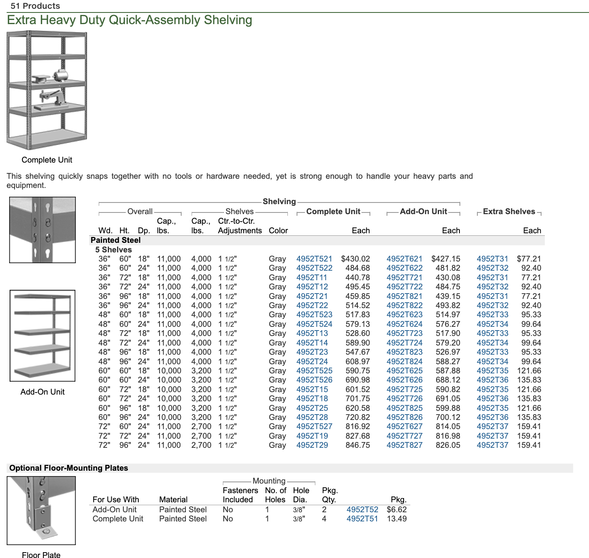
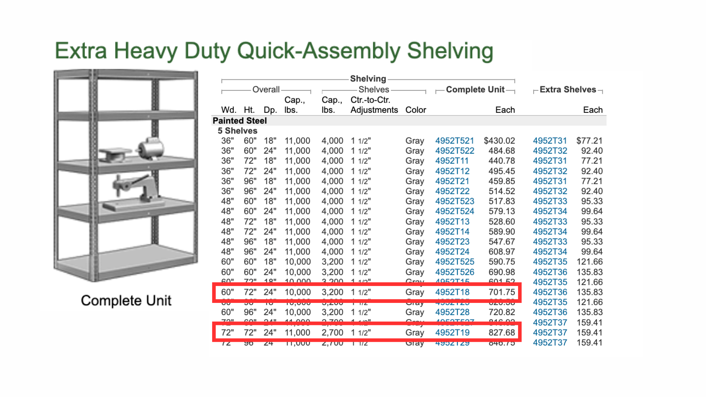
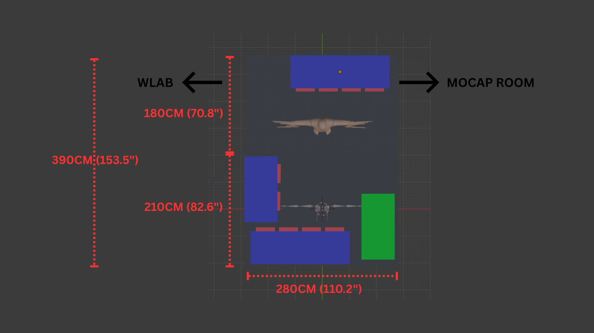
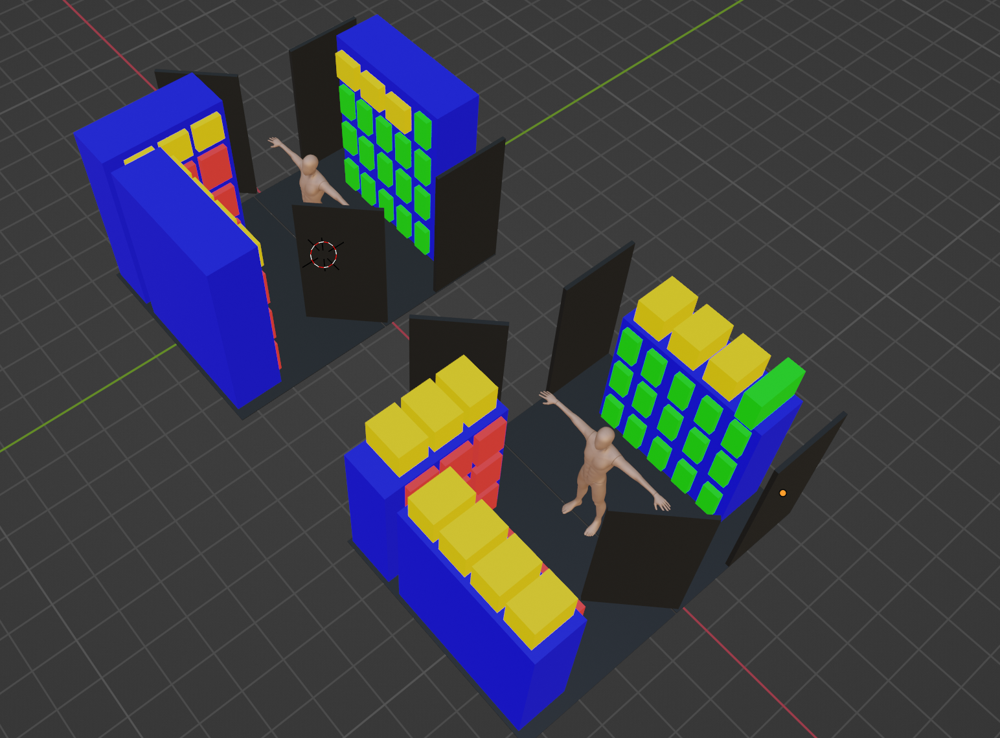
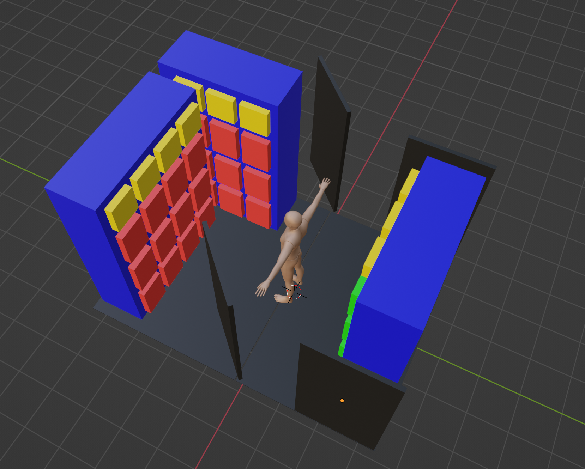
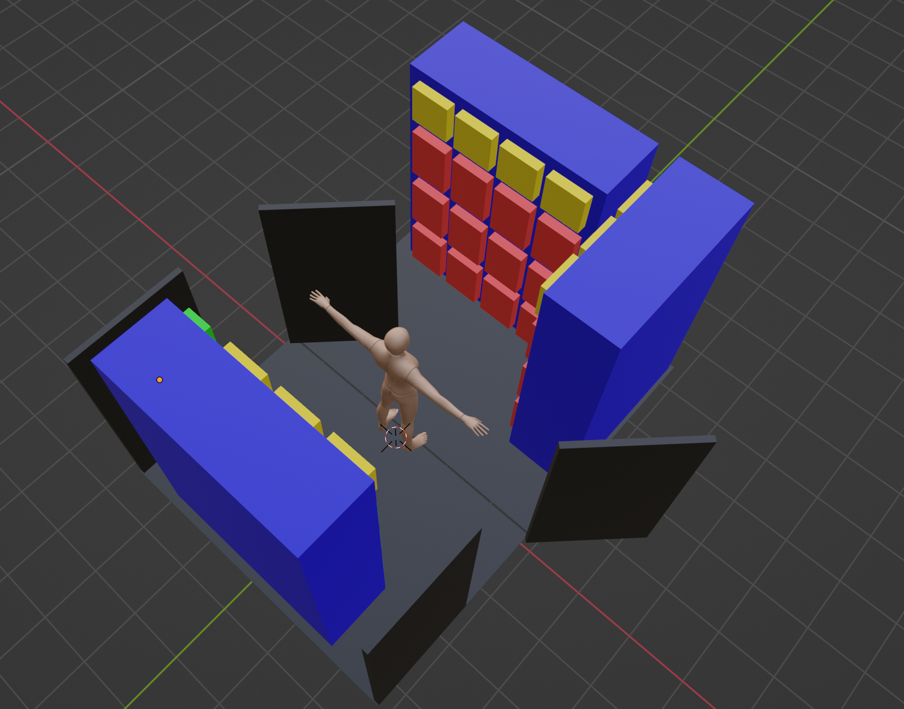
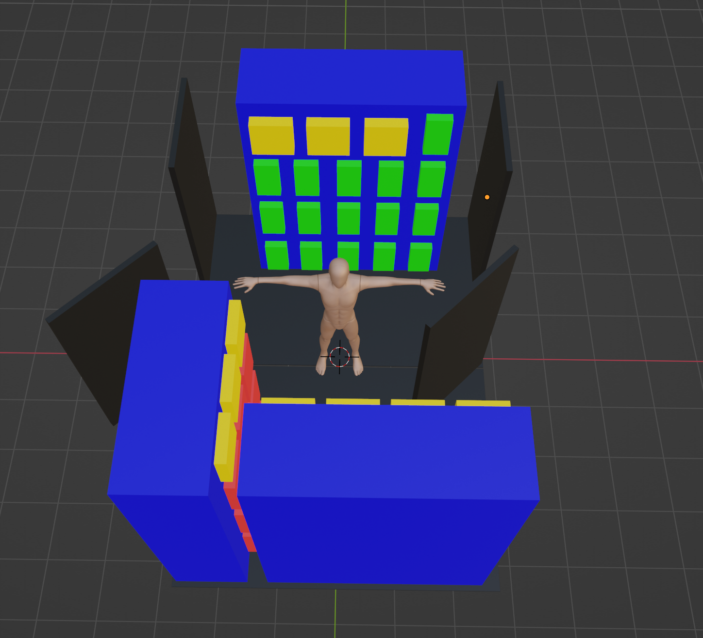
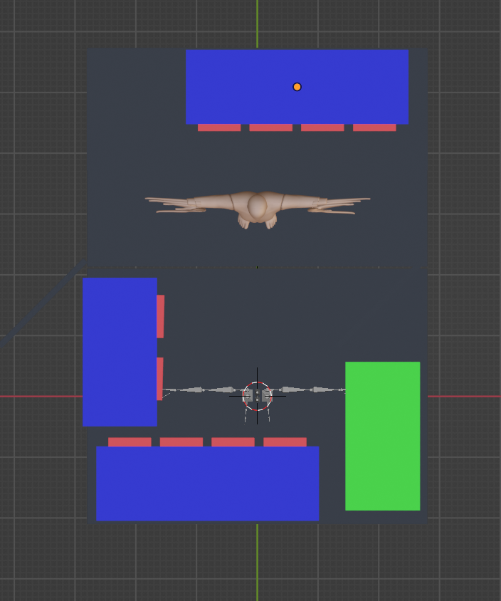

# Navy Yard Lighting Storage Plan

## Purchase List

### [McMaster-Carr Extra Heavy Duty Shelving](https://www.mcmaster.com/products/shelving/shelving-1~/extra-heavy-duty-quick-assembly-shelving-9/)

> **Note:** Shelving must be at least 24" (61 cm) below ceiling lights.

#### Option A: 96" Height

| Qty | Size (Imperial) | Size (Metric) | Part Number | Unit Price | Total |
|-----|-----------------|---------------|-------------|------------|-------|
| 2 | 72" × 96" × 24" | 183 × 244 × 61 cm | 4952T29 | $847 | $1,694 |
| 1 | 60" × 96" × 24" | 152 × 244 × 61 cm | 4952T28 | $721 | $721 |
| **Total** | | | | | **$2,415** |

#### Option B: 72" Height (Recommended)

| Qty | Size (Imperial) | Size (Metric) | Part Number | Unit Price | Total |
|-----|-----------------|---------------|-------------|------------|-------|
| 2 | 72" × 72" × 24" | 183 × 183 × 61 cm | 4952T19 | $828 | $1,656 |
| 1 | 60" × 72" × 24" | 152 × 183 × 61 cm | 4952T18 | $702 | $702 |
| **Total** | | | | | **$2,358** |

> Option B: Top shelf remains usable as open space. Fixture capacity unchanged, only flexible storage reduced.

---

## Equipment to Store

| Equipment | Qty | Dimensions (cm / in) |
|-----------|-----|----------------------|
| LED Fresnel (LFD32) | 19 | 35 × 49 × 49 / 14" × 19" × 19" |
| LED Ellipsoidal | 2 | 25 × 47 × 35 / 10" × 19" × 14" |
| LED Cyclorama (LWCYC) | 16 | 41 × 63 × 21 / 16" × 25" × 8" |

See full inventory details: [Leviton Inventory Summary](Leviton_Inventory_Summary.md)

---

## Storage Space

| Dimension | Metric | Imperial |
|-----------|--------|----------|
| **Width** | 280 cm | 110.2" (9.2 ft) |
| **Total Depth** | 390 cm | 153.5" (12.8 ft) |
| **Upper Section** | 180 cm | 70.8" (5.9 ft) |
| **Lower Section** | 210 cm | 82.6" (6.9 ft) |
| **Height** | 250 cm | 98.4" (8.2 ft) |
| **Clearance Required** | 61 cm | 24" (from ceiling lights) |

---

## 3D Model

### Height Comparison (96" vs 72")

> Top shelf remains usable as open space. Fixture capacity unchanged, only flexible storage reduced.

### Views

| View 1 | View 2 |
|--------|--------|
|  |  |

| View 3 | Top View |
|--------|----------|
|  |  |

### Legend

| Color | Item | Dimensions (cm / in) |
|-------|------|----------------------|
| 🔴 Red | LED Fresnel | 35 × 49 × 49 / 14" × 19" × 19" |
| 🟢 Green | LED Cyclorama | 41 × 63 × 21 / 16" × 25" × 8" |
| 🟡 Yellow | Flexible (empty box, accessories) | 35 × 49 × 35 / 14" × 19" × 14" |
| 🔵 Blue | Shelving Units | 72" / 60" × 72" × 24" |

---

## Resources

- [3D Model (Blender)](yard-lightplan.blend)

---

*Last Updated: 2026-01-28*
