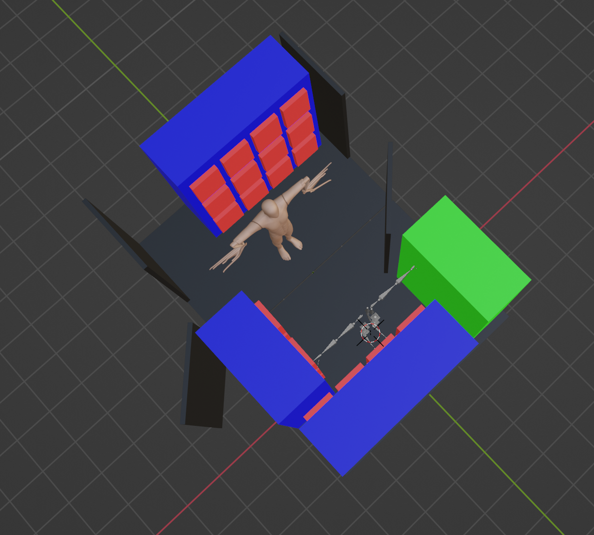

# Navy Yard Lighting Storage Plan

## Equipment Inventory

See full inventory details: [Leviton Inventory Summary](Leviton_Inventory_Summary.md)

---

## Storage Requirements

### Equipment to Store

| Equipment | Qty | Dimensions (cm / in) | Weight (kg) |
|-----------|-----|----------------------|-------------|
| LED Fresnel (LFD32) | 58 | 35 × 49 × 49 / 14" × 19" × 19" | ~8-10 each |
| LED Cyclorama (LWCYC) | 16 | 41 × 63 × 21 / 16" × 25" × 8" | 12.6 each |
| Barn Doors | 26 | Ø 30.5 / Ø 12" | - |
| DMX Cables | 144 | various | - |

**Total Fresnel weight:** ~580 kg (1,279 lbs)
**Total Cyclorama weight:** ~200 kg (441 lbs)

---

## Storage Space

| Dimension | Metric | Imperial |
|-----------|--------|----------|
| **Width** | 280 cm | 110.2" (9.2 ft) |
| **Total Depth** | 390 cm | 153.5" (12.8 ft) |
| **Upper Section** | 180 cm | 70.8" (5.9 ft) |
| **Lower Section** | 210 cm | 82.6" (6.9 ft) |
| **Height** | 250 cm | 98.4" (8.2 ft) |
| **Area** | ~9.2 m² | ~99 ft² |

### 3D Model

| Perspective View | Top View |
|------------------|----------|
|  |  |

---

## Storage Plan

### [McMaster-Carr Shelving](https://www.mcmaster.com/products/shelving/shelving-1~/extra-heavy-duty-quick-assembly-shelving-9/)

#### Recommended Model

| Spec | Imperial | Metric |
|------|----------|--------|
| **Model** | Extra Heavy Duty 48" × 96" × 24" | |
| **Part Number** | 4952T24 | |
| **Width** | 48" | 122 cm |
| **Height** | 96" | 244 cm |
| **Depth** | 24" | 61 cm |
| **Shelves** | 5 layers (adjustable) | |
| **Total Capacity** | 11,000 lbs | 4,990 kg |
| **Per Shelf Capacity** | 4,000 lbs | 1,814 kg |
| **Price** | $609 each | |

---

### Shelf Assignments

| Shelf | Contents | Qty | Notes |
|-------|----------|-----|-------|
| **Shelf A** | LED Fresnel | 15 | 5 layers × 3 units |
| **Shelf B** | LED Fresnel | 15 | 5 layers × 3 units |
| **Shelf C** | LED Fresnel | 15 | 5 layers × 3 units |
| **Shelf D-1~3** | LED Fresnel | 13 | Remaining |
| **Shelf D-4** | Barn Doors | 26 | Top layer |
| **Shelf D-5** | DMX Cables | 144 | Bottom layer / bins |
| **Wall pipe** | Cyclorama | 16 | 深度 63 cm，用牆掛 |

> **Note:** Cyclorama 深度 63 cm 超過架子 61 cm，建議用牆掛管存放

---

### Shopping List

| Item | Model | Qty | Unit Price | Total |
|------|-------|-----|------------|-------|
| Extra Heavy Duty Shelf | 48" × 96" × 24" (4952T24) | 4 | $609 | $2,436 |
| Wall-mount pipe (Cyc) | 1.5" steel pipe, 280 cm | 2 | ~$60 | ~$120 |
| Pipe flanges | Wall mount | 4 | ~$15 | ~$60 |
| Cable storage bins | Large bins | 4 | ~$20 | ~$80 |
| **Total** | | | | **~$2,696** |

---

## Where to Buy

### Shelving

| Vendor | Product | Link |
|--------|---------|------|
| McMaster-Carr | Extra Heavy Duty 48" × 96" × 24" | [4952T24](https://www.mcmaster.com/4952T24/) |
| McMaster-Carr | Extra Shelves 48" × 24" | [4952T34](https://www.mcmaster.com/4952T34/) |

### Fixture Storage (Alternative)

| Vendor | Product | Notes |
|--------|---------|-------|
| [SSRC](https://ssrconline.com/fixture-cart.html) | Fixture Cart | US-based, 244 × 91 × 203 cm |
| [Backstage Equipment](https://backstageweb.com/headcarte02.html) | Head Cart E-02 | US-based |

### NYC Local Suppliers

| Vendor | Location | Notes |
|--------|----------|-------|
| [Barbizon Lighting](https://barbizon.com/) | NYC | Major theatrical supplier |
| [Syracuse Scenery](https://syracusescenery.com/) | Syracuse, NY | Full theatrical dealer |

---

## Summary

| Item | Qty | Notes |
|------|-----|-------|
| McMaster Shelf 48" × 96" × 24" | 4 | Fresnel + Barn Doors + Cables |
| Wall Pipe | 2 | Cyclorama |
| **Total Cost** | ~$2,700 | |

---

## TODO

- [x] Confirm storage space dimensions (280 × 390 × 250 cm)
- [ ] Order McMaster shelving × 4
- [ ] Install wall pipe for Cyclorama
- [ ] Measure door width (WLAB / MOCAP access)

---

*Last Updated: 2026-01-28*
