# Unreal Engine 5.5 - DMX Image Based Lighting Guide

Using DMX Pixel Mapping to convert scene capture to DMX signal output for LED CYC fixtures.

**Demo Video:** [ue_demo.mp4](ue_demo.mp4)

---

## Hardware Connection Setup

### Equipment List

| Device | Purpose |
|--------|---------|
| Art-Net to DMX Converter | Art-Net to DMX512 + 12-port splitter |
| LED CYC | RGBW fixture |

### Connection Diagram

```
PC (Ethernet) ──► Obsidian Netron EN12 (Art-Net to DMX) ──► LED CYC
```

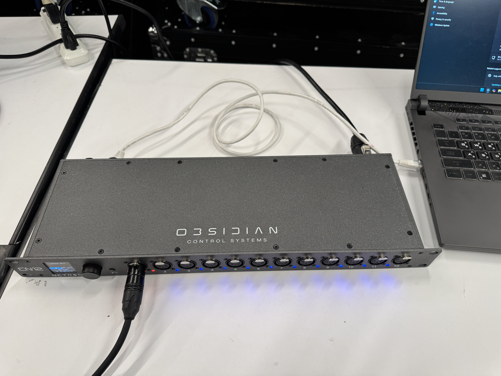

### Network Settings

**Windows Path:** Settings > Network & Internet > Ethernet

| Setting | Value |
|---------|-------|
| IP assignment | Manual |
| IPv4 address | 10.108.12.51 |
| IPv4 mask | 255.255.255.0 |

> **Why 10.108.12.x?** The Netron EN12 default IP is 10.108.12.43. PC must be on the same subnet (10.108.12.x) to communicate via Art-Net. Choose any available IP in range 10.108.12.1-254 (except .43).

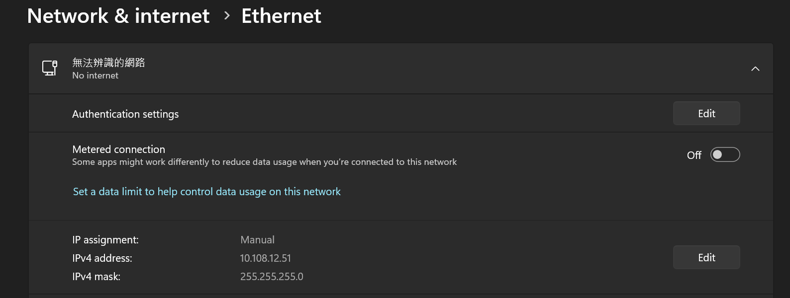

### Netron EN12 Settings

| Setting | Value |
|---------|-------|
| IP Address | 10.108.12.43 |
| Status | No Cue (Standby) |

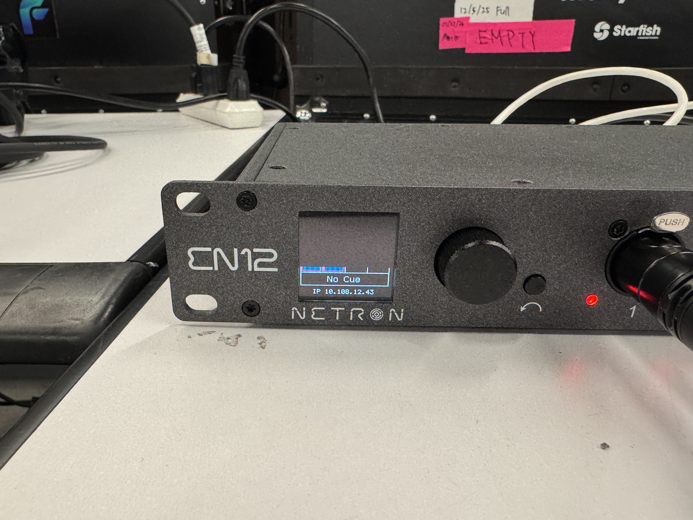

---

## 1. Enable DMX Plugins

**Edit > Plugins** search "DMX", enable the following:

| Plugin | Purpose |
|--------|---------|
| DMX Control Console | DMX testing console |
| DMX Engine | DMX core functionality |
| DMX Fixtures | Fixture Blueprints |
| DMX Pixel Mapping | Pixel mapping (core feature) |
| DMX Protocol | DMX protocol support |
| Remote Control Protocol DMX | Remote control |

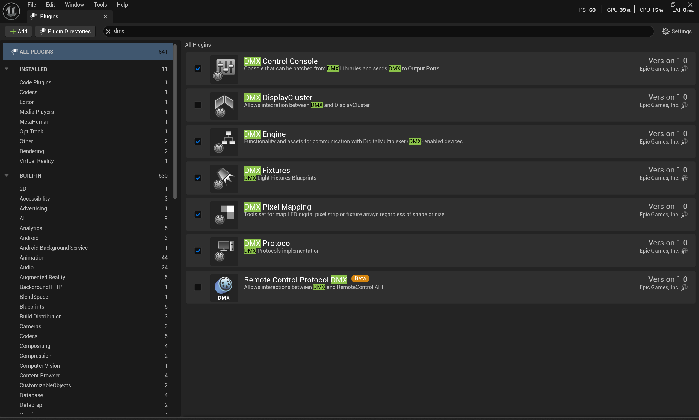

---

## 2. Create DMX Library

**Content Browser > Right-click > DMX > DMX Library**

Name: `DMXLib_CYC`

### 2.1 Configure Output Ports

In the **Library Settings** tab:

| Setting | Value |
|---------|-------|
| Output Port | OutputPort1 |
| Protocol | Art-Net |
| Local Universe | 1 - 10 |
| Extern Universe | 0 - 9 |
| Enabled | ✓ |

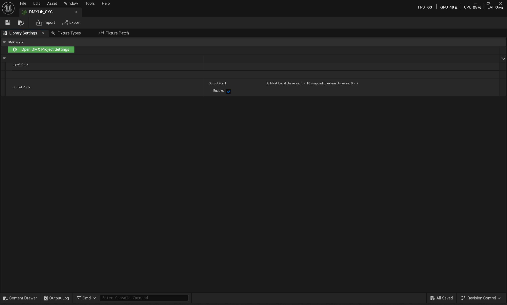

---

## 3. Project Settings - DMX

**Edit > Project Settings > Plugins > DMX**

| Setting | Value |
|---------|-------|
| Protocol Type | Art Net |
| Communication Type | Broadcast |
| Network Interface Card IP | 192.168.1.91 (your NIC IP) |
| Input into Engine | ✓ |
| Local Universe Start | 1 |
| Amount of Universes | 10 |
| Protocol Universe Remap | (configure as needed) |
| Send DMX by default | ✓ |
| Receive DMX by default | ✓ |

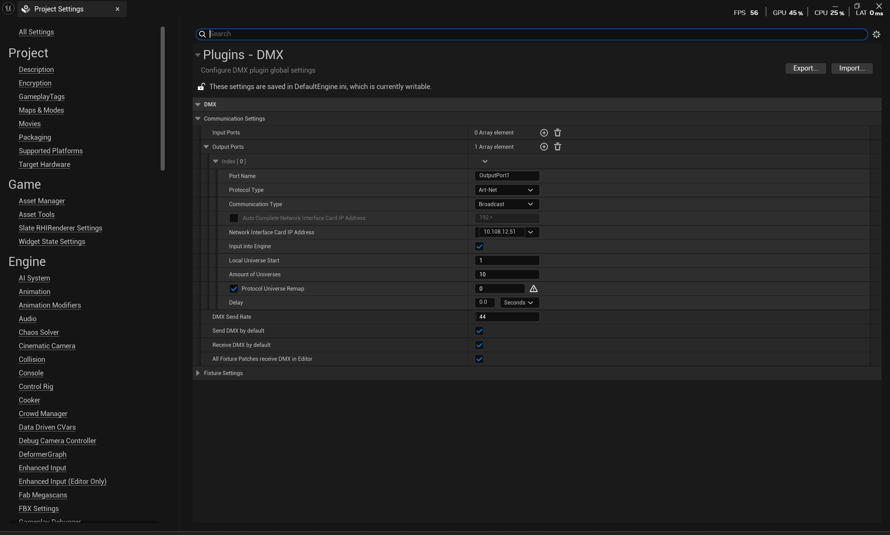

---

## 4. Create Fixture Type

In DMX Library **Fixture Types** tab:

### LWCYC (LED Cyclorama)

| Setting | Value |
|---------|-------|
| Name | LWCYC |
| DMX Category | Other |
| Mode | 4COL |
| Auto Channel Span | ✓ |
| Fixture Matrix Enabled | ✗ |

### Channel Configuration (4COL Mode)

| Ch | Name | Attribute |
|----|------|-----------|
| 1 | `<Function>` | Red |
| 2 | `<Function>` | Green |
| 3 | `<Function>` | Blue |
| 4 | `<Function>` | White |

**Function Settings:**
- Data Type: 8bit
- Attribute Mapping: Red/Green/Blue/White
- Physical From: 0
- Physical To: 1.0

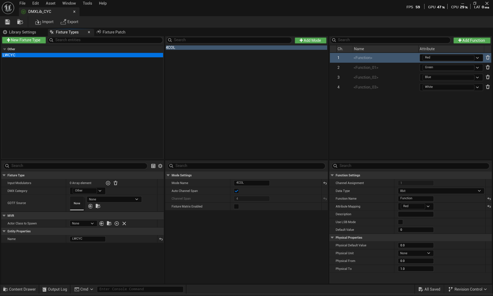

### LWCYC-00B DMX Channel Chart (4COL Mode)

| Ch | Control | DMX Value | Output |
|----|---------|-----------|--------|
| 1 | Red | 0-255 | Brightness 0-100% |
| 2 | Green | 0-255 | Brightness 0-100% |
| 3 | Blue | 0-255 | Brightness 0-100% |
| 4 | White | 0-255 | Brightness 0-100% |

---

## 5. Create Fixture Patch

In **Fixture Patch** tab, assign DMX addresses for each CYC fixture:

| Fixture | Type | Mode | Universe | Starting Ch |
|---------|------|------|----------|-------------|
| LWCYC | LWCYC | 4COL | 1 | 1 |
| LWCYC_001 | LWCYC | 4COL | 1 | 5 |
| LWCYC_002 | LWCYC | 4COL | 1 | 9 |
| LWCYC_003 | LWCYC | 4COL | 1 | 13 |

Each fixture uses 4 channels (RGBW).

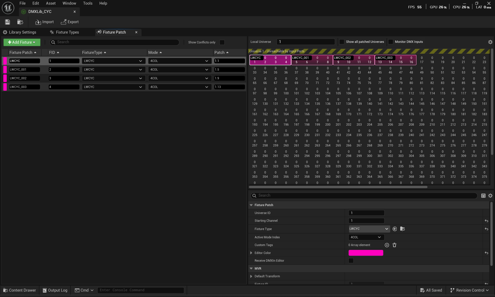

---

## 6. Create Render Target

**Content Browser > Right-click > Textures > Render Target**

Name: `RT_DownSample_CYC`

| Setting | Value |
|---------|-------|
| Size X | 128 |
| Size Y | 128 |
| Render Target Format | RTF RGBA16f |
| Clear Color | 0, 0, 0, 1 |
| Address X | Clamp |
| Address Y | Clamp |

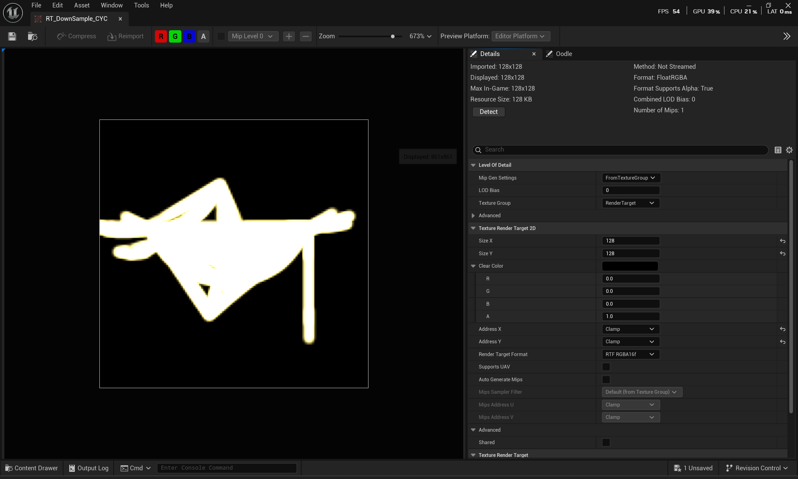

---

## 7. Create Scene Capture 2D

Place **BP_DownSampleSceneCapture_CYC** in the scene.

### Settings

| Property | Value |
|----------|-------|
| Texture Target | RT_DownSample_CYC |
| Capture Source | Final Color (LDR) |
| FOV | Adjust as needed |

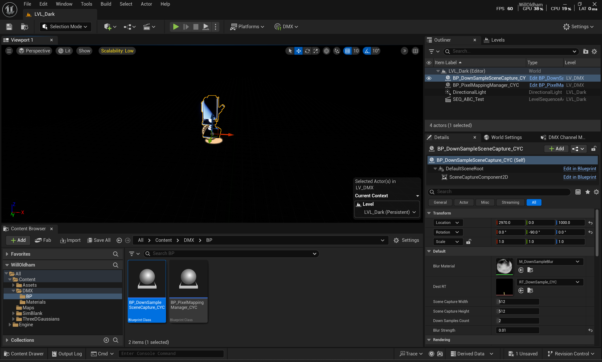

---

## 8. Configure DMX Pixel Mapping

**Content Browser > Right-click > DMX > DMX Pixel Mapping**

Name: `DMXPM_PixelMap_CYC`

### 8.1 Add Fixture Group

Select all LWCYC fixtures to add to Pixel Mapping.

### 8.2 Pixel Mapping Settings

| Setting | Value |
|---------|-------|
| Fixture Group | DMXLib_CYC |
| Input Texture | RT_DownSample_CYC |
| Distribution | Configure based on fixture layout |
| Apply Blur | (Optional) |

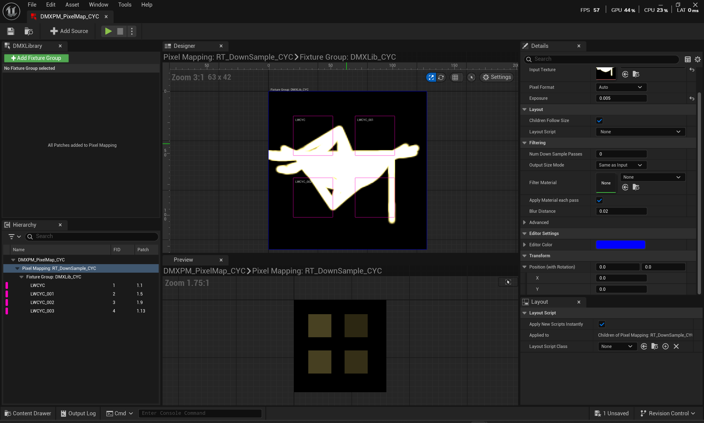

---

## 9. Blueprint Integration

Create **BP_PixelMappingManager_CYC**

### Event Graph

```
Event Tick
    |
    v
[Render Texture Sample and Send DMX]
    |
    +-- Delta Seconds: 0
    +-- Tick Component
    |
    v
[Get DMX Pixel Mapping Renderer Component]
    |
    +-- PixelMapping: DMXPM_PixelMap_CYC
    +-- Pixel Mapping: RT_DownSample_CYC
```

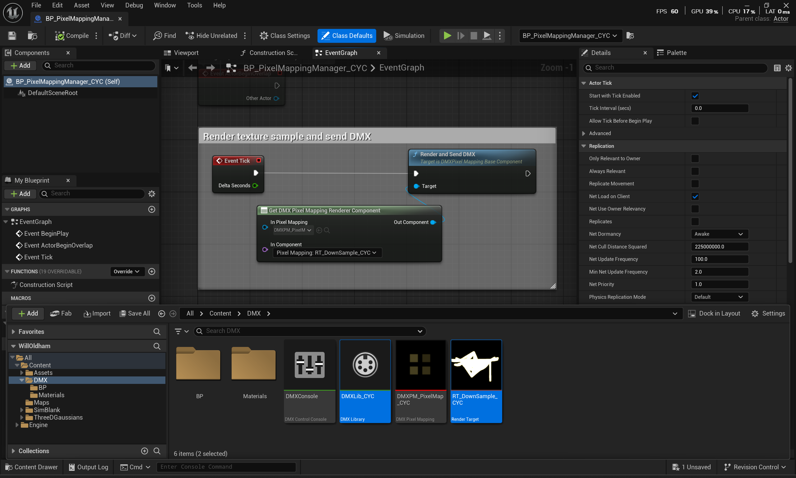

---

## 10. Level Setup

Place in Level:

1. **BP_DownSampleSceneCapture_CYC** - Captures scene image
2. **BP_PixelMappingManager_CYC** - Processes and sends DMX
3. **DirectionalLight** - Main scene light
4. **SEQ_ABC_Test** - (Optional) Sequencer animation

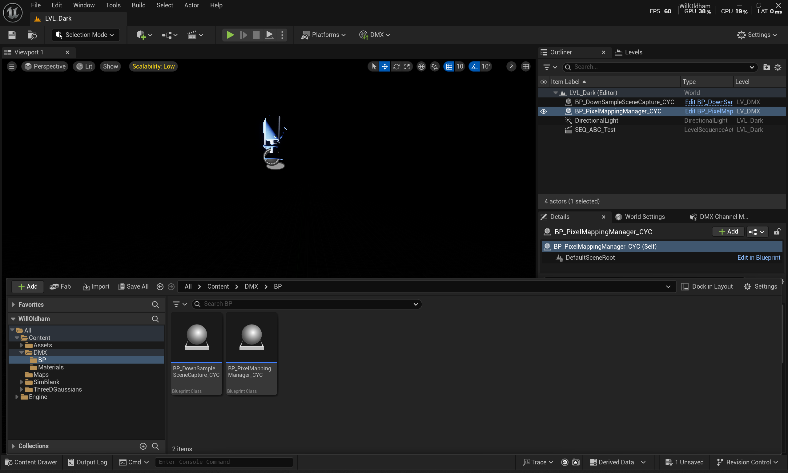

---

## 11. Testing - DMX Control Console

**Window > DMX Control Console**

Manually test RGBW output for each fixture:

| Fixture | Red | Green | Blue | White |
|---------|-----|-------|------|-------|
| LWCYC | 0-255 | 0-255 | 0-255 | 0-255 |

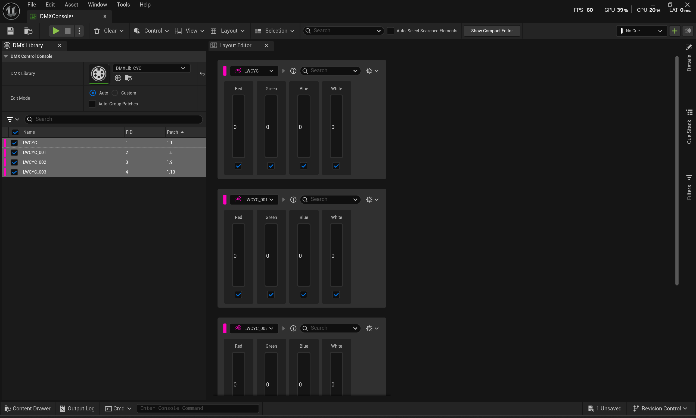

---

## Asset List

| Type | Name | Path |
|------|------|------|
| DMX Library | DMXLib_CYC | Content/DMX/ |
| Render Target | RT_DownSample_CYC | Content/DMX/ |
| Pixel Mapping | DMXPM_PixelMap_CYC | Content/DMX/ |
| Blueprint | BP_PixelMappingManager_CYC | Content/DMX/BP/ |
| Blueprint | BP_DownSampleSceneCapture_CYC | Content/DMX/BP/ |

---

## Workflow Summary

```
Scene Capture 2D
      |
      v
Render Target (128x128)
      |
      v
DMX Pixel Mapping
      |
      v
DMX Library (Fixture Patch)
      |
      v
Art-Net Output (UDP Broadcast)
      |
      v
Obsidian Netron EN12 (Art-Net to DMX)
      |
      v
LED CYC Fixtures (RGBW)
```

---

*Unreal Engine 5.5 | Last Updated: 2026-02-04*
